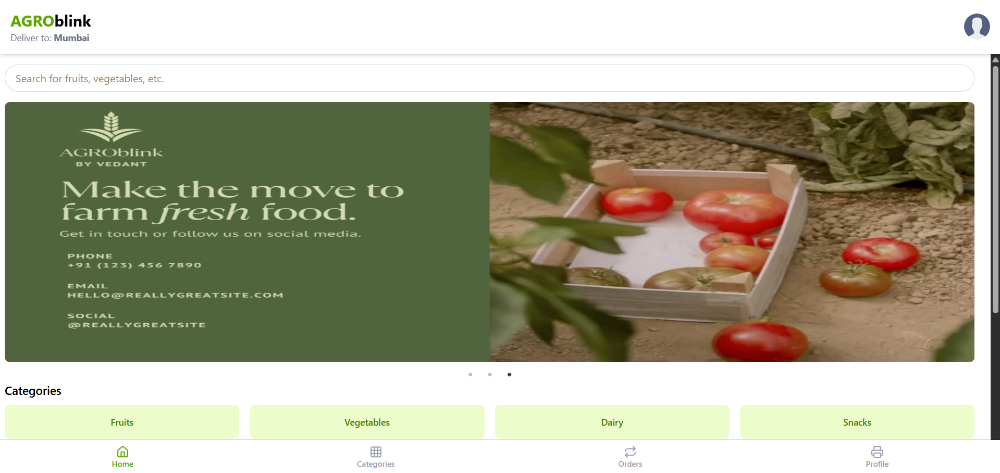

# 🌾 AgroBlink

AgroBlink is a modern, React-based e-commerce platform tailored for agricultural products. It connects farmers, retailers, and consumers in a seamless digital marketplace.

---

## 🚀 Features

- 🔐 User Authentication (Login/Signup)
- 🛍️ Browse and purchase agricultural products
- 🎯 Personalized user dashboard
- 📦 Order management system
- 📸 Upload profile pictures
- 🌐 Backend API integration (Express.js)
- 🎨 Clean, responsive UI with Tailwind CSS

---

## 🛠️ Tech Stack

| Frontend     | Backend     | Database    | Others              |
|--------------|-------------|-------------|---------------------|
| React        | Express.js  | MongoDB     | Vite, Tailwind CSS  |
| React Router | Node.js     | Mongoose    | Axios, Lucide Icons |

---

## 📸 Screenshots

